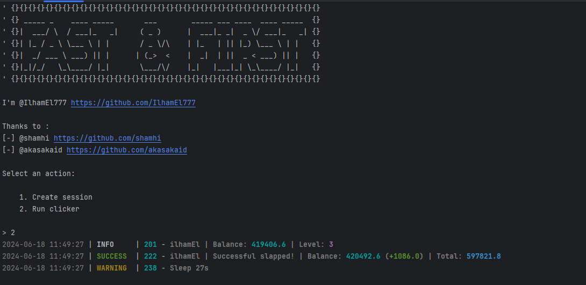

[](https://t.me/ilham_el)

## **Link Game**: [Fast & First](https://t.me/FirstDuck_bot/FirstDuck?startapp=2061272263)



## Functionality
| Functional                                            | Supported |
|-------------------------------------------------------|:---------:|
| Multithreading                                        |     ✅     |
| Binding a proxy to a session                          |     ✅     |
| Auto-purchase of items if you have coins (**belum ada**)  |     ❌     |
| Random sleep time between clicks                      |     ✅     |
| Random number of clicks per request                   |     ✅     |

## [Settings](https://github.com/IlhamEl777/Fast-First/blob/main/.env-example)
| Setting                | Description                                                                            |
|--------------------------|----------------------------------------------------------------------------------------|
| **API_ID / API_HASH**    | Platform data from which to launch a Telegram session (stock - Android)                |
| **MIN_AVAILABLE_ENERGY** | Minimum amount of available energy, upon reaching which there will be a delay (eg 100) |
| **SLEEP_BY_MIN_ENERGY**  | Delay when reaching minimum energy in seconds (eg 200)                                 |
| **ADD_SLAPS_ON_TURBO**   | How many taps will be added when turbo is activated (eg 2500)                          |
| **APPLY_DAILY_ENERGY**   | Whether to use the daily free energy boost (True / False) !belum ada!                  |
| **APPLY_DAILY_TURBO**    | Whether to use the daily free turbo boost (True / False)  !belum ada!                  |
| **RANDOM_CLICKS_COUNT**  | Random number of taps (eg 50,200)                                                      |
| **SLEEP_BETWEEN_SLAP**   | Random delay between taps in seconds (eg 10,25)                                        |
| **SLEEP_INCORECT_TIME**   | Delay when show message incorect time  (eg 120)                                        |
| **USE_PROXY_FROM_FILE**  | Whether to use proxy from the `bot/config/proxies.txt` file (True / False)             |

## Installation
You can download [**Repository**](https://github.com/IlhamEl777/Fast-First) by cloning it to your system and installing the necessary dependencies:
```shell
~ >>> git clone https://github.com/IlhamEl777/Fast-First.git
~ >>> cd Fast-First

#Linux
~/Fast-First >>> python3 -m venv venv
~/Fast-First >>> source venv/bin/activate
~/Fast-First >>> pip3 install -r requirements.txt
~/Fast-First >>> cp .env-example .env
~/Fast-First >>> nano .env # Here you must specify your API_ID and API_HASH , the rest is taken by default
~/Fast-First >>> python3 main.py

#Windows
~/Fast-First >>> python -m venv venv
~/Fast-First >>> venv\Scripts\activate
~/Fast-First >>> pip install -r requirements.txt
~/Fast-First >>> copy .env-example .env
~/Fast-First >>> # Specify your API_ID and API_HASH, the rest is taken by default
~/Fast-First >>> python main.py
```

Also for quick launch you can use arguments, for example:
```shell
~/Fast-First >>> python3 main.py --action (1/2)
# Or
~/Fast-First >>> python3 main.py -a (1/2)

#1 - Create session
#2 - Run clicker
```
